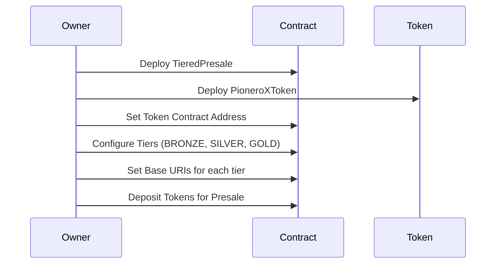
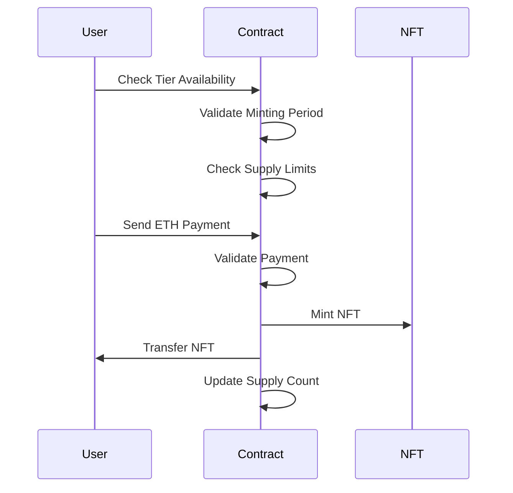
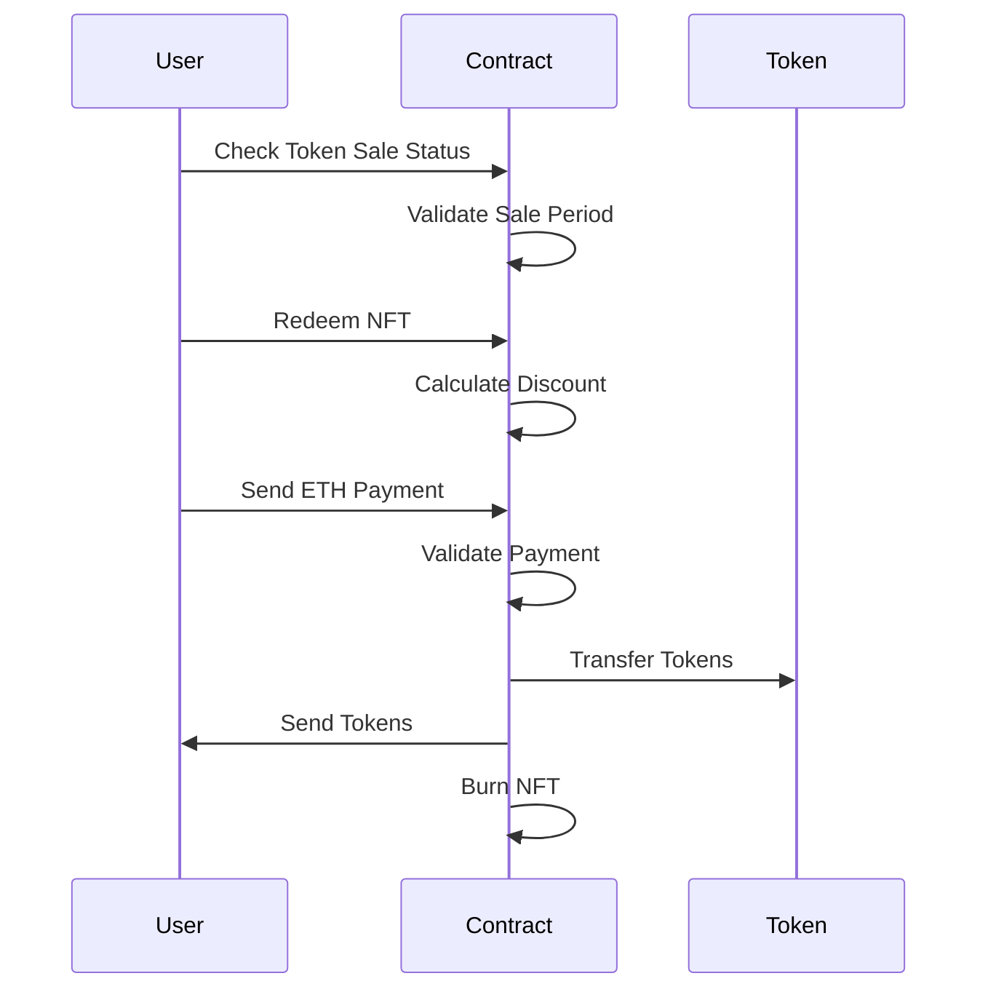
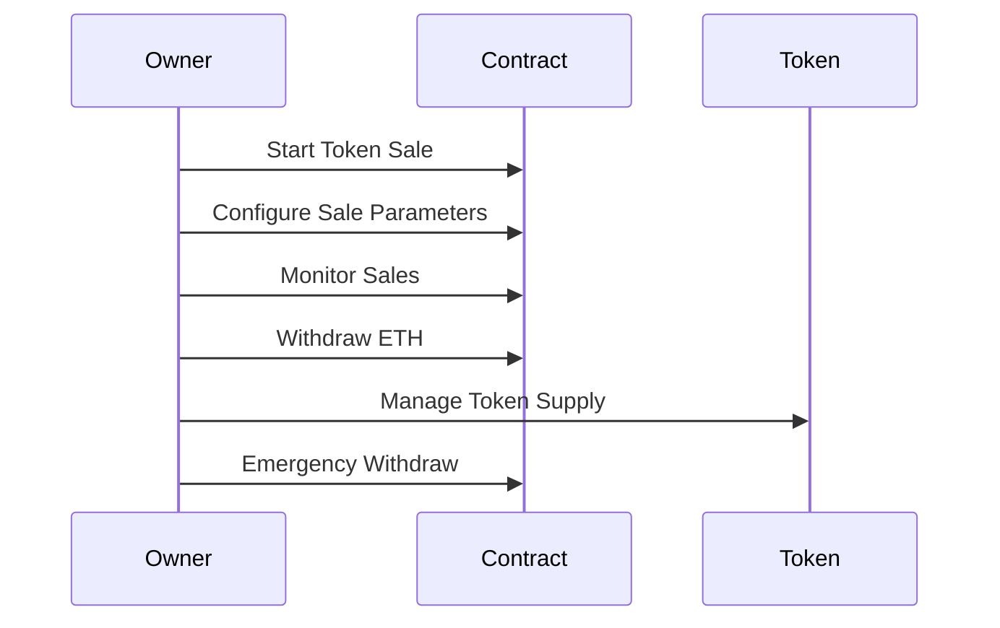
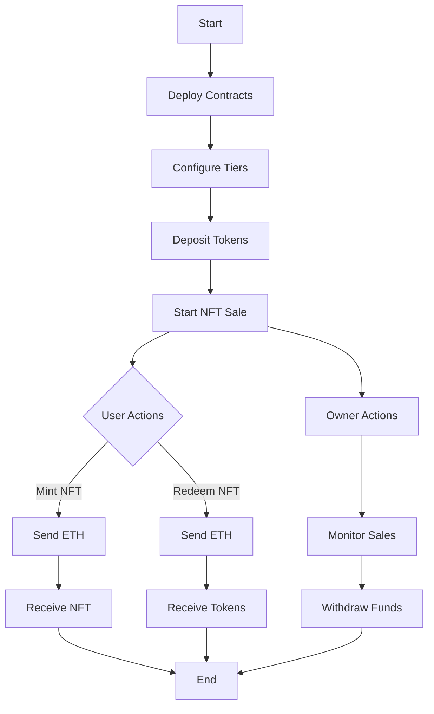

# PioneroX - Tiered NFT Presale System

<div align="center">
  
  <p><em>Visual representation of the project's structure and components</em></p>
</div>

## Overview

PioneroX is a sophisticated tiered NFT presale system built on the Arbitrum network. It implements a unique mechanism where users can purchase NFTs of different tiers (BRONZE, SILVER, GOLD) and later redeem them for PioneroX tokens with tier-specific discounts.

## Protocol Flow Diagrams

### 1. Initial Setup Flow


### 2. NFT Minting Flow


### 3. Token Redemption Flow


### 4. Owner Management Flow


### 5. Complete Protocol Flow


## Features

- **Tiered NFT System**: Three distinct tiers (BRONZE, SILVER, GOLD) with different benefits
- **Token Redemption**: Convert NFTs into PioneroX tokens with tier-based discounts
- **Secure Smart Contracts**: Built with security best practices and reentrancy protection
- **Flexible Configuration**: Adjustable parameters for each tier and token sale
- **Metadata Support**: IPFS-based metadata for NFTs
- **Owner Controls**: Comprehensive management functions for contract owners

## Smart Contracts

### PioneroXToken (ERC20)

The PioneroX token is an ERC20 token with the following features:
- Burnable functionality
- Owner-controlled minting
- Reentrancy protection
- Standard ERC20 compliance

### TieredPresale

The presale contract implements:
- Tiered NFT minting system
- Token redemption mechanism
- Configurable tier parameters
- Secure payment handling
- Emergency withdrawal functions

## Technical Specifications

### NFT Tiers

| Tier    | Benefits                    | Discount % |
|---------|-----------------------------|------------|
| BRONZE  | Basic tier access           | 10%        |
| SILVER  | Enhanced benefits           | 25%        |
| GOLD    | Premium tier with max perks | 50%        |

### Contract Details

- **Solidity Version**: 0.8.26
- **Network**: Arbitrum Mainnet
- **Framework**: Foundry
- **OpenZeppelin**: Latest version

## Installation

1. Clone the repository:
```bash
git clone https://github.com/your-username/pionerox.git
cd pionerox
```

2. Install dependencies:
```bash
forge install
```

3. Compile contracts:
```bash
forge build
```

## Deployment

1. Set up your environment variables in `.env`:
```bash
PRIVATE_KEY=your_private_key
ETHERSCAN_API_KEY=your_etherscan_api_key
ARBITRUM_RPC_URL=your_arbitrum_rpc_url
```

2. Deploy to Arbitrum Mainnet:
```bash
forge script script/Deploy.s.sol:DeployScript --rpc-url $ARBITRUM_RPC_URL --broadcast --verify -vvvv
```

## Usage

### For Users

1. **Mint NFT**
   - Choose your desired tier
   - Send the required ETH amount
   - Receive your NFT

2. **Redeem for Tokens**
   - Wait for token sale to start
   - Redeem your NFT for PioneroX tokens
   - Enjoy tier-specific discounts

### For Contract Owner

1. **Configure Tiers**
   ```solidity
   configureTier(
       Tier tier,
       uint256 price,
       uint256 maxSupply,
       uint256 discountPercentage,
       uint256 mintStartTime,
       uint256 mintEndTime
   )
   ```

2. **Start Token Sale**
   ```solidity
   startTokenSale(
       uint256 _tokenPrice,
       uint256 _saleDuration,
       uint256 _claimDeadline
   )
   ```

3. **Manage Tokens**
   - Deposit tokens into the contract
   - Withdraw collected ETH
   - Emergency withdrawal if needed

## Security Features

- Reentrancy protection on all critical functions
- Owner-only administrative functions
- Emergency withdrawal capabilities
- Input validation and requirements
- Safe token transfers using SafeERC20

## Testing

Run the test suite:
```bash
forge test
```

## Contributing

1. Fork the repository
2. Create your feature branch (`git checkout -b feature/amazing-feature`)
3. Commit your changes (`git commit -m 'Add some amazing feature'`)
4. Push to the branch (`git push origin feature/amazing-feature`)
5. Open a Pull Request

## License

This project is licensed under the MIT License - see the [LICENSE](LICENSE) file for details.

## Contact

- Website: [pionerox.com](https://pionerox.com)
- Twitter: [@PioneroX](https://twitter.com/PioneroX)
- Discord: [Join our community](https://discord.gg/pionerox)

## Acknowledgments

- OpenZeppelin for their secure smart contract libraries
- Arbitrum for their Layer 2 scaling solution
- The Foundry team for their development framework
